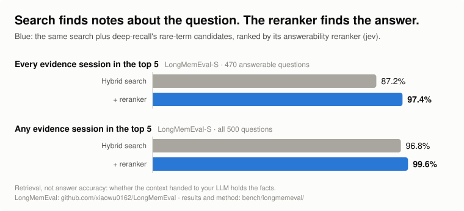
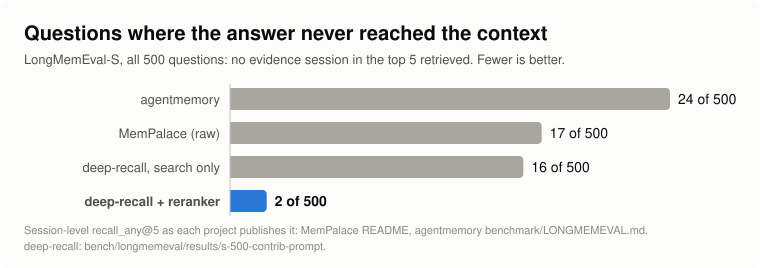

# Deep Recall

**Search finds notes about your question. Deep Recall finds the one that answers it.**

Memory for AI agents, over plain Markdown notes. A hybrid search gathers candidates, then a
**reranker** reads each passage and scores one thing: *does this contain the answer?* The passages that
do go to your model, so whatever LLM you plug in gets the facts, not the neighbourhood.

<p align="center"></p>

- **99.6% on LongMemEval-S.** On 498 of 500 questions, evidence for the answer reached the top 5 files.
  On 97.4% of the answerable ones, *all* of it did. These are retrieval numbers: they measure the context,
  not a model's answer. [Method and per-question results](bench/longmemeval/).
- **Any LLM.** Deep Recall returns context. Claude, GPT, Gemini or a local model does the answering.
- **About half a cent a question** with the `jev` reranker. A free local cross-encoder is built in, and
  any model that returns a score plugs in.
- **Your notes stay Markdown.** The index is one SQLite file next to them.

```
$ deeprecall recall "Which electricity plan did we switch to?"
1. 0.90  home/utilities.md
         § Home utilities > Electricity
2. 0.01  projects/journal-3.md

--- #1 winning section (home/utilities.md) ---
## Electricity
... After a long call we switched to the **Saver Plus 12** plan: 12.76 cents per kWh ...
```

In Claude Code:

```bash
claude plugin marketplace add turlockmike/deep-recall
claude plugin install deep-recall@deep-recall
```

then `/deep-recall:setup ~/notes`. Other ways to install are [below](#install).

## How it compares

<p align="center"></p>

Memory systems that publish LongMemEval-S retrieval numbers find the right conversation most of the time,
and Deep Recall's own search is in the same range (16 misses). The reranker is what takes it to 2.
The competing figures are each project's own session-level `recall_any@5`, read from its repository.

Most published LongMemEval scores are end to end: a memory system *plus* a chosen answering model and
judge, so they measure the model as much as the memory. How those compare, a 50-question end-to-end spot
check of Deep Recall, and the full results are in [docs/benchmarks.md](docs/benchmarks.md).

## Install

### As a Claude Code plugin

```bash
claude plugin marketplace add turlockmike/deep-recall
claude plugin install deep-recall@deep-recall
```

Then, in Claude Code: `/deep-recall:setup ~/notes`. This writes a config, builds the index and runs
a first lookup. Requirements: [`uv`](https://docs.astral.sh/uv/), plus `ripgrep` (optional, makes
the rare-term leg faster). The plugin's `bin/deeprecall` creates its own Python environment on
first use.

The plugin provides:

| Piece | What it does |
|---|---|
| MCP server `deeprecall` | tools `recall(question)`, `search(query)`, `reindex()` Claude calls natively |
| skill `recall` | tells Claude when to look things up in your notes and how to read the scores |
| `/deep-recall:recall <question>` | one-shot lookup |
| `/deep-recall:setup [folder]` | guided config + first index |
| `/deep-recall:reindex` | refresh after edits |
| SessionStart hook | incremental re-index in the background (only when a config exists) |
| `deeprecall` on PATH | the CLI, while the plugin is enabled |

### As a Python package / CLI

```bash
uv tool install 'git+https://github.com/turlockmike/deep-recall[mcp]'   # or: pip install -e '.[mcp]'
deeprecall init --root ~/notes
deeprecall index
deeprecall recall "When is the lawn service scheduled?"
```

## Commands

```
deeprecall init [--root DIR ...] [--backend NAME] [--here]   write config (global, or ./.deeprecall/)
deeprecall index [--full]                                     build / incrementally update
deeprecall search "terms" [-k 10]                            first-stage hybrid search (free, fast)
deeprecall recall "question?" [--top 5] [--backend NAME]     answer-aware recall
deeprecall status                                             config, index size, reranker, spend
deeprecall rerankers                                          list reranker backends
deeprecall eval questions.jsonl [--limit N] [--max-usd 1]    hit@1 / hit@3: search vs recall
```

Only question-shaped queries (ending in `?`, or starting with a question word) are reranked. Keyword
lookups ("electricity plan") return search order, free and instant, because "does this passage
state the answer?" is ill-posed for them.

## How it works

1. **Index (SQLite).**
   - Keyword: FTS5 (`porter unicode61`).
   - Vectors: sqlite-vec with [fastembed](https://github.com/qdrant/fastembed) `BAAI/bge-small-en-v1.5` (384-d, ONNX, CPU).
   - File vector: the mean of its 350-word chunk vectors. Frontmatter `summary`/`description` is added as an extra chunk.
   - Files longer than 350 words are also indexed **section by section**, split at Markdown headings.
   - Incremental: re-indexes only files whose content hash changed.
2. **First stage.**
   - Keyword leg: BM25.
   - Vector leg: a long file is scored by its *best section*, not a diluted file average.
   - Fusion: reciprocal rank fusion (k=60, keyword weight 0.5).
3. **Rare-term leg.**
   - Pulls distinctive tokens out of the question: `tool-names`, `IDs_like_this`, ALLCAPS, CamelCase, letter+digit codes, capitalised phrases, quoted strings.
   - Exact-matches them with ripgrep, keeping terms found in ≤ 12 files.
   - Pairs of common terms that are rare *together* also count.
   - Embeddings blur identifiers and BM25 splits them; this leg fixes most first-stage misses.
4. **Rerank.**
   - Each candidate file is cut into heading-bounded windows, sized to the reranker (≤ 24 per file).
   - The reranker scores every window as P(states the answer), and a file takes its best window.
5. **Widen when unsure.** If the best score is below the backend's threshold, widen once to the top 150 and score only the new files.
   - Optional, `jev` only (`[recall] question_kinds = true`): one small request first classifies the question as a single fact, a latest value, an aggregate, a question about time, or a recommendation. Aggregate and temporal questions always widen, because a count or a timeline needs every mention and one confident hit says nothing about the rest. Recommendations are scored with a prompt that asks whether a passage says something about the user that should shape the answer.
6. **Fail open.** Any reranker error (network, auth, budget) returns first-stage order with a note.

## Rerankers (plug in any "jev-like" model)

| backend | where it runs | cost | notes |
|---|---|---|---|
| `cross-encoder` (default) | local CPU (fastembed ONNX) | free | `Xenova/ms-marco-MiniLM-L-6-v2`; also `-L-12-v2`, `BAAI/bge-reranker-base`, `jinaai/jina-reranker-v2-base-multilingual` |
| `jev` | [TypeSafe](https://docs.typesafe.ai) API | ~0.3–1.5¢/question | calibrated yes/no decision model; strongest tested |
| `openai` | any OpenAI-compatible endpoint with logprobs | provider price | OpenAI, OpenRouter, Together, Groq, vLLM, llama.cpp, LM Studio… P(yes) from first-token logprobs |
| `command` | any executable | yours | JSON on stdin → scores on stdout; any language |
| `none` | — | free | first-stage order only |

```toml
[reranker]
backend = "jev"                  # needs TYPESAFE_API_KEY
# widen_at = 0.7                 # override the backend's confidence threshold
# window_words = 600
# kind_prompts = {}              # with question_kinds: per-kind prompts; {} keeps one prompt for every kind

[recall]
# question_kinds = true          # classify the question first; see "Widen when unsure" above
# widen_kinds = ["aggregate", "temporal"]
```

```toml
[reranker]
backend = "openai"
base_url = "http://localhost:8000/v1"   # e.g. a local vLLM
model = "Qwen/Qwen2.5-7B-Instruct"
api_key_env = "OPENAI_API_KEY"
usd_per_mtok = 0.0
```

```toml
[reranker]
backend = "command"
command = ["python3", "/path/to/my_scorer.py"]   # reads {"question","passages":[{path,heading,text}]}
                                                   # prints [0.93, 0.02, ...]
```

### Writing a reranker in Python

```python
from deeprecall.rerankers.base import Reranker, Passage

class MyReranker(Reranker):
    name = "mine"
    window_words = 400      # passage size you want
    widen_at = 0.6          # below this, deeprecall widens the pool once
    usd_per_token = 0.0     # for the spend meter

    def __init__(self, **options):          # the [reranker] table
        ...

    def score(self, question: str, passages: list[Passage]) -> list[float]:
        # return P(passage states the answer) in [0, 1], one per passage
        ...
```

Register it with an entry point, `[project.entry-points."deeprecall.rerankers"] mine = "pkg.mod:MyReranker"`,
or set `backend = "pkg.mod:MyReranker"` directly.

What mattered in testing:
- **Score each passage independently.** Asking a model to pick the best of N files was worse than scoring files one by one.
- **Ask about answerability, not relevance:** "does this passage *explicitly state* the fact that answers the question?"
- **Questions that combine facts need a different question.** "How many hours did I drive in total?" has no
  passage that states the answer, so every partial fact scores at the floor. Asking whether a passage holds
  *part of* the answer ([`contrib-prompt.txt`](bench/longmemeval/contrib-prompt.txt), set as `prompt` under
  `[reranker]`) put all evidence in the top 5 on 50/50 LongMemEval questions against 48/50 for the default.

## Cost control

Every paid call is estimated before it's sent and recorded in `spend.jsonl` next to the index.
Two caps apply, and a refusal falls back to first-stage order:

```toml
[budget]
max_usd_per_query = 0.05
daily_cap_usd = 1.00        # rolling 24h across all processes; 0 disables
```

`deeprecall status` shows spend for the last 24 hours and all time.

## Evaluate on your own notes

```jsonl
{"q": "Which electricity plan did we switch to?", "gold": ["home/utilities.md"]}
```

```bash
deeprecall eval my-questions.jsonl --limit 30 --max-usd 0.50
```

Exact-path scoring undercounts when another note states the same fact in other words. For headline
numbers, have a blind judge check the non-gold top hits.

## Config reference

`deeprecall init` writes a commented template. It lives at `./.deeprecall/config.toml` (with
`--here`) or `~/.config/deeprecall/config.toml`. The first one found walking up from the current
directory wins. `$DEEPRECALL_CONFIG` overrides the lookup.
Environment overrides: `DEEPRECALL_ROOTS` (path-separated), `DEEPRECALL_INDEX`, `DEEPRECALL_RERANKER`.

## Limits

- Markdown only (`*.md`).
- First index is CPU-bound (one embedding per 350-word chunk and per section). A LongMemEval-S haystack (about 80k words) indexes in about 21 s on an Apple M4 Pro. Later runs only re-embed changed files.
- Hosted rerankers send note text to that provider. Use `cross-encoder` or a local `openai`-compatible server for private notes.

## Development

```bash
uv venv && uv pip install -e '.[mcp,dev]'
.venv/bin/pytest -q                      # offline: hash embedder + fake rerankers
claude plugin validate . --strict
claude --plugin-dir .                    # load the plugin for one session
```
